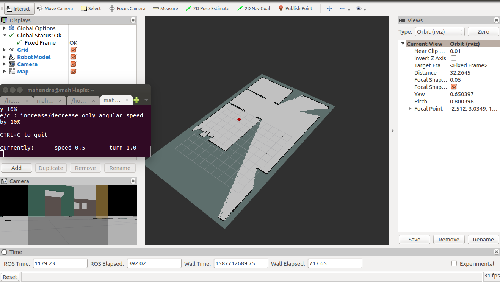
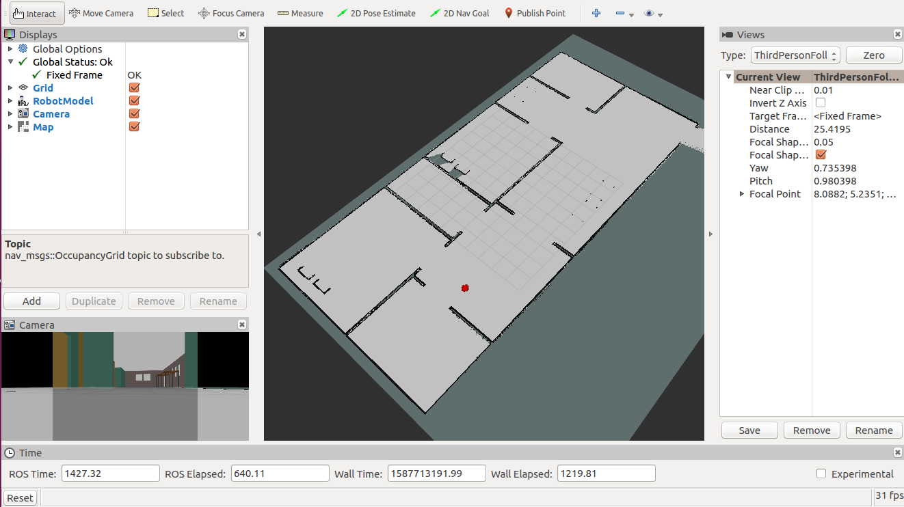
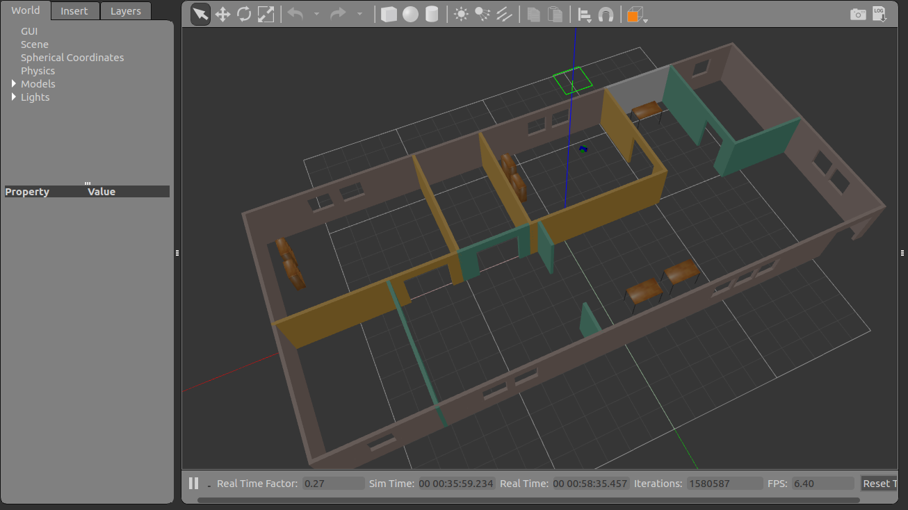
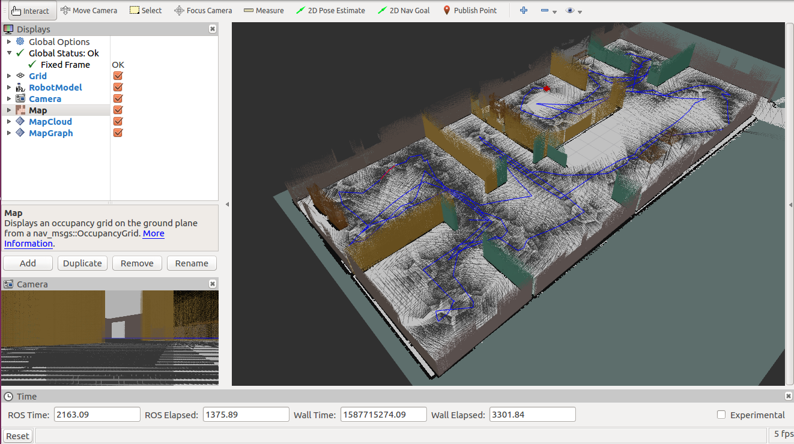

# Building_map_using-RTAB-Map
Creating a 2D occupancy grid and 3D octomap from a simulated environment using our own robot with the RTAB-Map package. 

RTAB-Map (Real-Time Appearance-Based Mapping) is a popular solution for SLAM to develop robots that can map environments in 3D. RTAB-Map has good speed and memory management.

## created rtabmap.db link:
https://drive.google.com/open?id=1l-IBZUUwQS6dScZRNhfZHVYGwS1TWcDd

## Ros packages used:
1. rtabmap_ros
2. turlebot_teleop
3. rviz

## Installation:
### Install RTAB-map package
```
$ sudo apt-get install ros-kinetic-rtabmap-ros
```

## Steps to Launch:
### step 1 create the catkin_ws
```
$ mkdir -p /home/workspace/catkin_ws/src
$ cd /home/workspace/catkin_ws/src
$ catkin_init_workspace
$ cd ..
$ catkin_make
```

### Step 2 Perform a System Update/Upgrade
```
$ apt-get update
$ apt-get upgrade -y
```
### Step 3 Clone the Package in src
```
$ cd /home/workspace/catkin_ws/src
$ git clone https://github.com/mahendraseervi/Building_map_using_RTAB-Map.git
```
### Step 4 Build the Packages
```
$ catkin_make
$ source devel/setup.bash
```
### Step 5 Launch the myhouse gazebo world with my_robot 
```
$ roslaunch my_robot world.launch 
```
### Step 6 Launch the rviz and save the required configuration
```
$ rosrun rviz rviz 
```
### Step 7 run Rtab_mapping launch file created
```
$ roslaunch rtab_mapping mapping.launch 
```

### Step 7 use the teleop_twist_keyboard to move the robot and create the map
```
$ rosrun teleop_twist_keyboard teleop_twist_keyboard.py 
```
Now, you should see Gazebo and rviz launching with robot inside it. Move aroud the robot inside gazebo world and create the map of the world

## Images :
### 2D map creating (in process):


### 2D map created:


### gazebo world:


### 3D map created:


